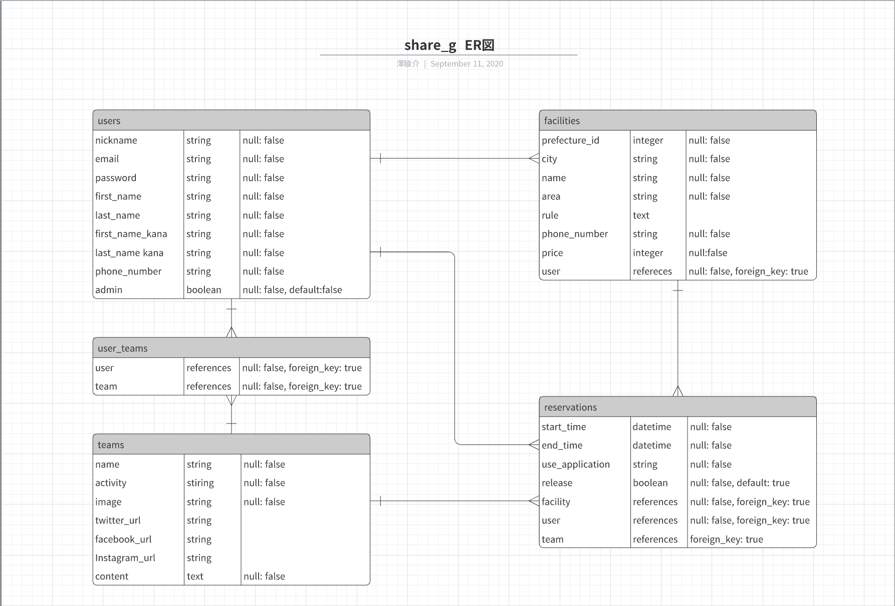

# ShareG

# 概要

# 本番環境（デプロイ先、テストアカウントとID）

# 制作背景

# DEMO

# 使用技術（開発環境）

# 課題や今後実装したい機能

# DB設計

## users テーブル

| Column          | Type    | Options     |
| --------------- | ------- | ----------- |
| nickname        | string  | null: false |
| email           | string  | null: false |
| password        | string  | null: false |
| first_name      | string  | null: false |
| last_name       | string  | null: false |
| first_name_kana | string  | null: false |
| last_name_kana  | string  | null: false |
| phone_number    | string  | null: false |
| admin           | boolean | null: false |

### Association

- has_many :facilities
- has_many :reservations
- has_many :team_users

## facilities テーブル

| Column        | Type       | Options                        |
| ------------- | ---------- | ------------------------------ |
| prefecture_id | integer    | null: false                    |
| city          | string     | null: false                    |
| name          | string     | null: false                    |
| area          | string     | null: false                    |
| rule          | text       |                                |
| phone_number  | string     | null: false                    |
| price         | integer    | null: false                    |
| user          | references | null: false, foreign_key: true |

### Association

- has_many   :reservations
- belongs_to :user
- belongs_to_active_hash :prefecture
- belongs_to_active_hash :city

## reservations テーブル

| Column          | Type       | Options                        |
| --------------- | ---------- | ------------------------------ |
| start_time      | datetime   | null: false                    |
| end_time        | datetime   | null: false                    |
| use_application | string     | null: false                    |
| release         | boolean    | null: false, default: false    |
| facility        | references | null: false, foreign_key: true |
| user            | references | null: false, foreign_key: true |
| team            | references | foreign_key: true              |

### Association

- belongs_to :facility
- belongs_to :user
- belongs_to :team

## teams テーブル

| Column        | Type   | Options     |
| ------------- | ------ | ----------- |
| name          | string | null: false |
| activity      | string | null: false |
| image         | string | null: false |
| twitter_url   | string |             |
| facebook_url  | string |             |
| instagram_url | string |             |
| content       | text   | null: false |

### Association

- has_many :team_users
- has_many :reservations

## team_users テーブル

| Column | Type       | Options                        |
| ------ | ---------- | ------------------------------ |
| user   | references | null: false, foreign_key: true |
| team   | references | null: false, foreign_key: true |

### Association

- belongs_to :user
- belongs_to :team

## ER図

