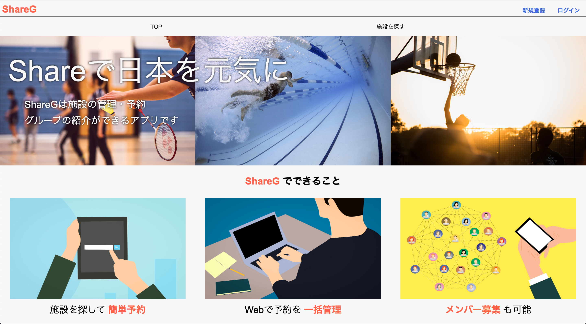
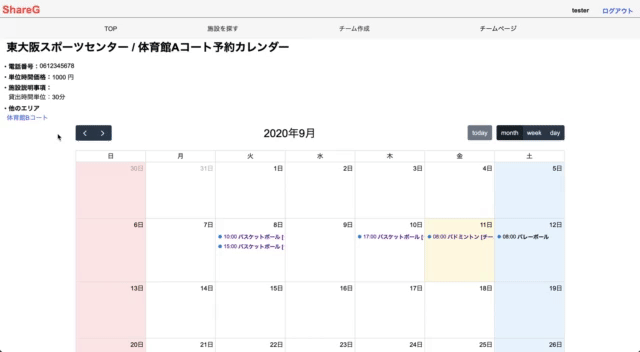
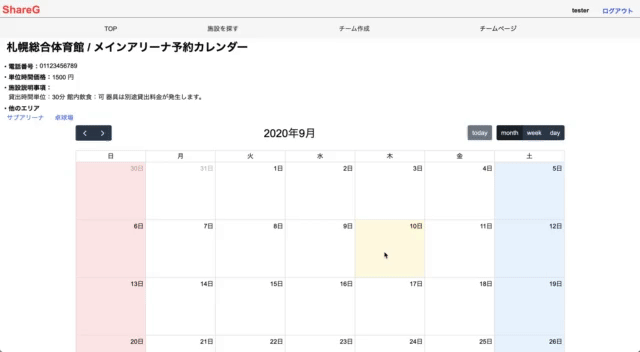
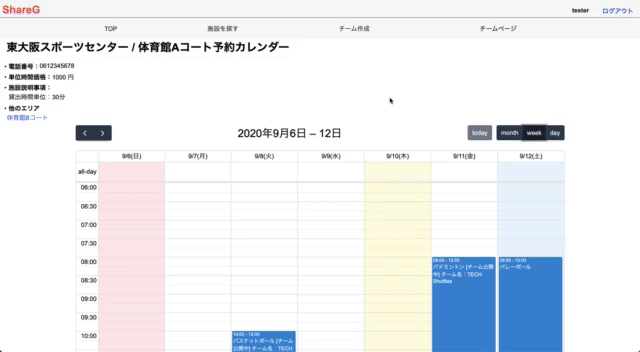

# ShareG

# 概要
カレンダー形式で施設の管理 / 予約ができるアプリケーションです。 
また、施設の利用者(予約者)は、サークルの紹介ページを作成することができます。 
予約にサークル情報を付与することで、メンバーの募集等を行うことも可能です。 
 

# 本番環境
## 本番環境
[https://share-g.herokuapp.com/](https://share-g.herokuapp.com/) 
 

## テストアカウント
### 施設管理者用
- メールアドレス：`admin@test.com`
- パスワード：`test123`
### 施設利用者用1
- メールアドレス：`tester@test.com`
- パスワード：`test123`
### 施設利用者用2
- メールアドレス：`tester2@test.com`
- パスワード：`test123`
 

# 制作背景
社会人バスケットボールサークルで活動していた時の困りごとを解消したいと思い、制作に至りました。 
また、本制作と同時に施設管理者の立場での課題も検討しました。以下に具体的な課題を記載いたします。 
 

### 1. 施設の予約 / 利用者
- 自治体ごとに予約方法が異なり、自治体のWebページが存在しても初回登録のために自治体に出向く必要がある
- 登録をしても利用できる自治体が限られている

### 2. サークルを探している人
- SNSやWebサイトを活用して探すには時間がかかる
- 良いサークルを見つけても自宅から遠いことが多々ある

### 3. 施設の管理者
- 自治体ごとにWebサイトを作成するためのコストと時間が必要
- Webサイトを保有していない場合、マニュアルでの予約管理が必要
 

# DEMO
## 施設検索機能
JSを利用した連動プルダウンリストで施設を検索し、施設ごとの予約カレンダーを表示すことが可能です。 
 

 
 
 

## 施設予約のカレンダー表示機能
FullCalendarを利用することで非同期的にmonthly,weekly,dailyのカレンダーを切り替えることが可能です。 
 

 
 
 

## 施設予約機能
予約情報を入力し、登録することでカレンダー上に予約情報を表示することが可能です。 
 

 
 
 

## 予約情報へのサークルページ連携機能
予約時にチーム情報の公開を選択することで、カレンダー上の予約をクリックしてチームページに遷移することが可能です。 
 

 
 
 

# 使用技術（開発環境）
## 開発環境
HTML / CSS / Ruby / Ruby on Rails(6.0.0) / JavaScript / SQL / Github / Heroku / Visual Studio Code
 
 

## 使用したライブラリ / プラグイン
### Gem
- devise
- active_storage
- active_hash

### プラグイン
- FullCalendar(5.3.2)
 
 

# 課題や今後実装したい機能
実装途中やアプリケーションの動作確認時（他者利用含む）において、抽出した課題を以下に洗い出しをしております。 
今後も継続してこれらの課題に対して新たな実装を行うことでより良いアプリケーションに改善いたします。 
 

## 解消すべき課題
- 既に予約されている時間帯に重複して予約を重ねることができる
- 経過した日付の予約情報がDBに蓄積され続ける
- 予約情報をJSONで取得しているが、期間を指定できておらず、施設に関わる全てのレコードを取得してしまっている
- チーム情報を予約カレンダーから探す必要があり、特定のチームを探したい時に手間がかかる
 
 
## 実装したい機能
- 施設の予約を変更 / 削除する機能
- 予約時のカード決済機能
 

# DB設計

## users テーブル

| Column          | Type    | Options     |
| --------------- | ------- | ----------- |
| nickname        | string  | null: false |
| email           | string  | null: false |
| password        | string  | null: false |
| first_name      | string  | null: false |
| last_name       | string  | null: false |
| first_name_kana | string  | null: false |
| last_name_kana  | string  | null: false |
| phone_number    | string  | null: false |
| admin           | boolean | null: false |

### Association

- has_many :facilities
- has_many :reservations
- has_many :team_users
 

## facilities テーブル

| Column        | Type       | Options                        |
| ------------- | ---------- | ------------------------------ |
| prefecture_id | integer    | null: false                    |
| city          | string     | null: false                    |
| name          | string     | null: false                    |
| area          | string     | null: false                    |
| rule          | text       |                                |
| phone_number  | string     | null: false                    |
| price         | integer    | null: false                    |
| user          | references | null: false, foreign_key: true |

### Association

- has_many   :reservations
- belongs_to :user
- belongs_to_active_hash :prefecture
- belongs_to_active_hash :city
 

## reservations テーブル

| Column          | Type       | Options                        |
| --------------- | ---------- | ------------------------------ |
| start_time      | datetime   | null: false                    |
| end_time        | datetime   | null: false                    |
| use_application | string     | null: false                    |
| release         | boolean    | null: false, default: false    |
| facility        | references | null: false, foreign_key: true |
| user            | references | null: false, foreign_key: true |
| team            | references | foreign_key: true              |

### Association

- belongs_to :facility
- belongs_to :user
- belongs_to :team
 

## teams テーブル

| Column        | Type   | Options     |
| ------------- | ------ | ----------- |
| name          | string | null: false |
| activity      | string | null: false |
| image         | string | null: false |
| twitter_url   | string |             |
| facebook_url  | string |             |
| instagram_url | string |             |
| content       | text   | null: false |

### Association

- has_many :team_users
- has_many :reservations
 

## team_users テーブル

| Column | Type       | Options                        |
| ------ | ---------- | ------------------------------ |
| user   | references | null: false, foreign_key: true |
| team   | references | null: false, foreign_key: true |

### Association

- belongs_to :user
- belongs_to :team
 

## ER図

